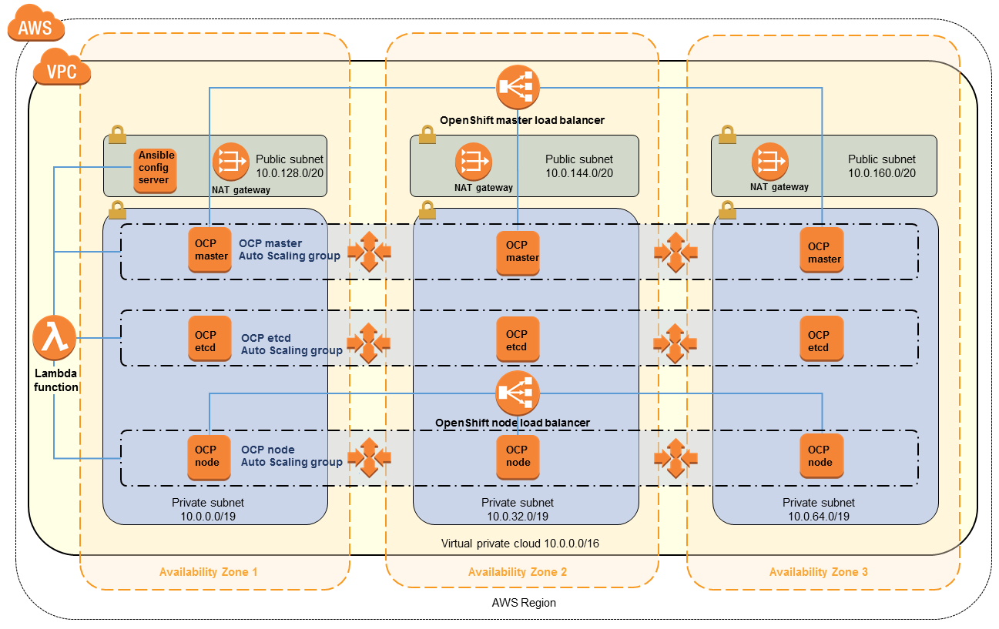
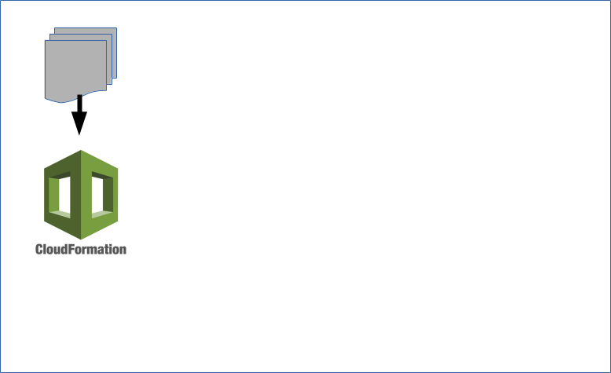
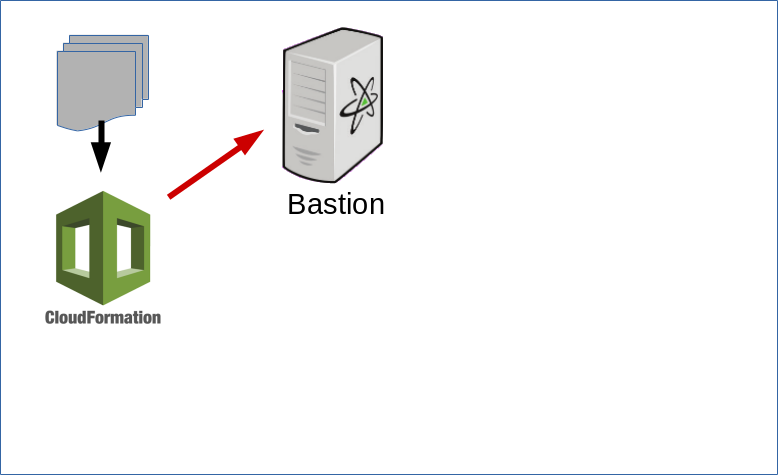
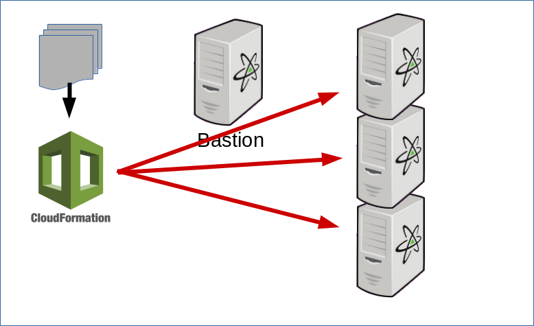
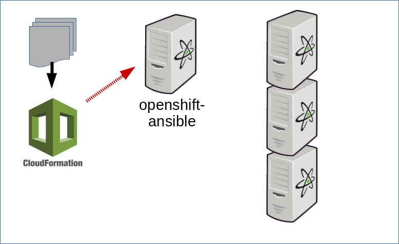
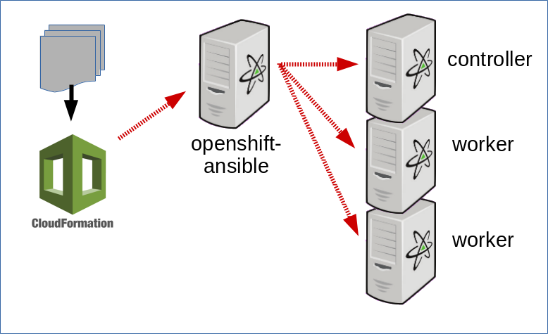
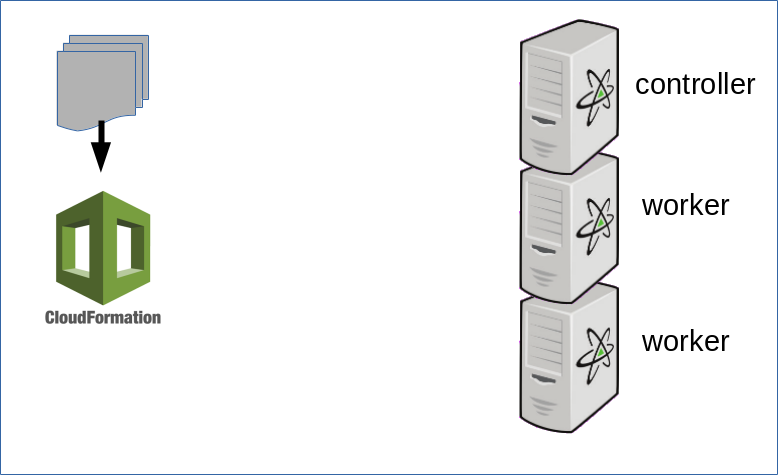

## A Cloud-Native Stack on AWS in 30 Minutes

.sigblock[
David Duncan 
Amazon.com

Josh Berkus 
Red Hat

DevConf.cz 2018
]

---

#### First, demo!

---

#### 00:29:59

---

tinyurl.com/y9ayloca

github.com/davdunc/quickstart-openshift-fah
 develop branch

github.com/jberkus/aws-fah-30

---

---

## minimal deployment

OpenShift Origin 
Fedora Atomic Host 
3 AWS EC2 Nodes

---

## minimal deployment

AWS CloudFormation 
openshift-ansible 
Elastic Block Store 
AWS Lambda 
system containers 
regular containers 
Source2Image

---

---

## Fedora Atomic Host

* Fastest moving AH
* newest tools
* minimal host
* container-centric

---

### Why Atomic for AWS?

---

#### best image for Origin

---

#### small/fast

---

#### atomic updates

---

#### small attack surface

---

#### DevOps

---

## Atomic DevOps

* deploy, don't modify
* centralize management
* separate layers

---

#### 00:14:42

### deployed?

---

#### OK, now you!

---

### walk-through

---

your aws account

approx cost: $6 USD

---

## minimal install

* 3 nodes 
  (1 master, 2 workers)
* t2-large instances
* routes via IP address 
  (no CDN or ELB)

modify to meet your requirements

---

---

---

---

---

---

---

## CloudFormation

* free
* easy
* nothing to install
* teardown support

---

## CF Alternatives

* terraform
* regular ansible
* openshift-ansible AWS mode

---

#### CloudFormation Walkthrough

---

## parameters

---

## openshift-ansible

*the* installation script

* trial --> prod
* containerized install
* in development

---

#### let's run!

---

## productionizing

* set up Elastic Load Balancer 
  (and maybe Route 53 DNS)
* more/bigger nodes
* HA master
* dynamic EBS volumes

---

## deploy an app!

* presentation app
* uses S2I 
  (abuses python-s2i)
* super simple/fast

---

## teardown

---

## practice at home

https://tinyurl.com/y9ayloca

* change parameters
* deploy your own apps
* play with Atomic

---

# ¿questions?

.left-column-narrow[
atomic:

more jberkus:

more dduncan:

&nbsp;
]

.right-column-wide[
projectatomic.io

@fuzzychef 
jberkus.github.io

@davdunc 
davdunc@amazon.com

&nbsp;
]

.leftlogo[]

.rightlogo[]
