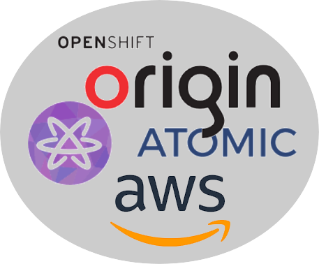

## A Cloud-Native Stack on AWS in 30 Minutes

.sigblock[
David Duncan
Amazon.com

Josh Berkus
Red Hat

DevConf.cz 2018
]

---

# ¿questions?

.left-column-narrow[
more jberkus:

Red Hat:

&nbsp;
]

.right-column-wide[
@fuzzychef 
www.databasesoup.com 
jberkus.github.io

community.redhat.com

&nbsp;
]

.leftlogo[]

.rightlogo[]
